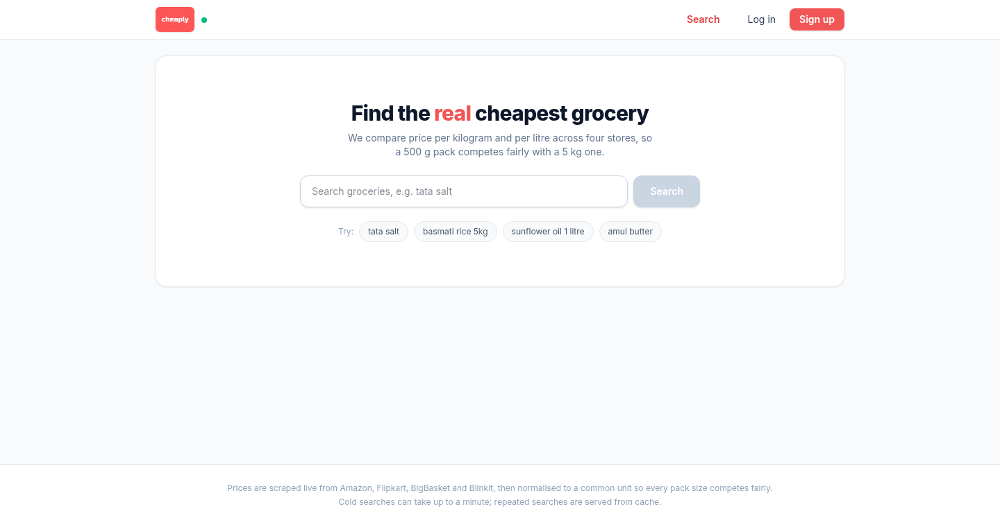
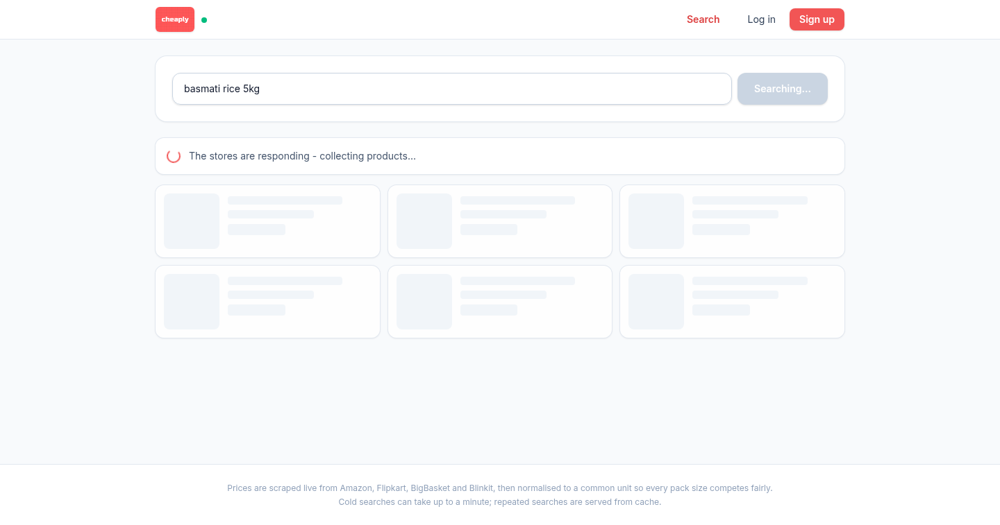
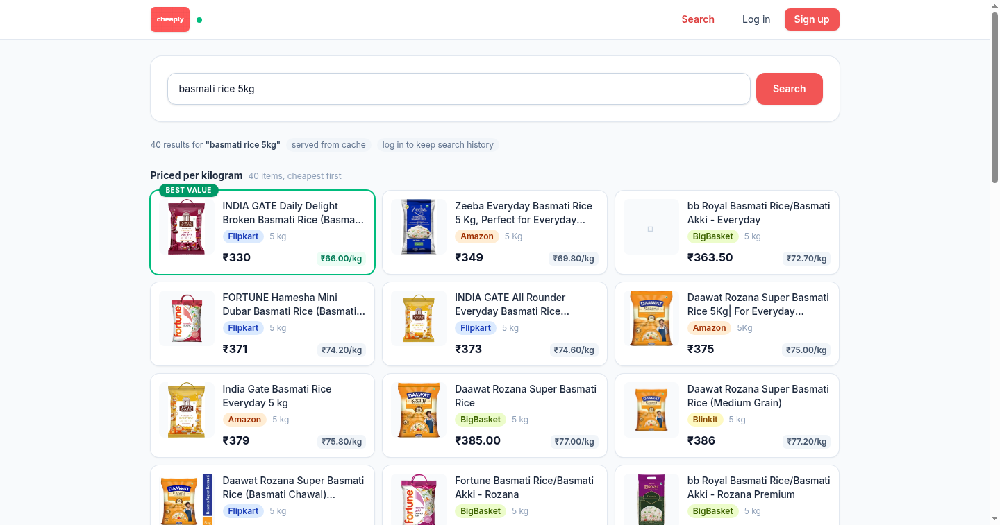

# Cheaply

Grocery price comparison across Indian online stores (Amazon, Flipkart
Grocery, BigBasket and Blinkit). Scrapes all three in parallel, normalises every price to a
common unit (per kg / per litre), and ranks results cheapest-first within
each unit - so 500 g of one brand competes fairly with 5 kg of another.

## Screenshots

| Home | Live scrape in progress | Ranked results |
|---|---|---|
|  |  |  |

## Architecture

```
React frontend :3000 (nginx, proxies /api)
        |
        v
Spring Boot backend :8080        <- auth (JWT), caching, normalising, ranking
        |                 \
        v                  v
Python scraper :internal   PostgreSQL + Redis
(Flask + Selenium,
 3 headless Chromes)
```

- **cheaply-backend/** - Spring Boot 3 / Java 21. REST API, JWT auth with
  refresh-token rotation and revocation, Redis-backed search cache, Flyway
  migrations, per-client rate limiting.
- **scraper-service/** - Flask. Drives three headless Chrome instances in
  parallel; reports a per-store status (ok / empty / failed) so a broken
  store is never mistaken for "no results". Reachable only from the backend
  (shared `X-API-Key`, not published on the host).
- **frontend/** - React 18 + TypeScript + TailwindCSS (Vite). Unit-grouped
  results with best-value highlighting, honest partial-result and rate-limit
  states, JWT session with deduplicated refresh-token rotation. Tokens live
  in localStorage - a deliberate simplicity/XSS trade-off for this project.

## Running the stack

Prerequisites: Docker Desktop.

```bash
cp .env.example .env
# Fill in the secrets - the stack refuses to start without them.
# JWT_SECRET:  openssl rand -hex 32
docker compose up --build
```

| Service    | URL                                     |
|------------|-----------------------------------------|
| Web app    | http://localhost:3000                   |
| API        | http://localhost:8080                   |
| Swagger UI | http://localhost:8080/swagger-ui.html   |
| Health     | http://localhost:8080/actuator/health   |

Try a search (no account needed; a cold search takes up to ~45s while three
stores are scraped, repeats are served from cache):

```bash
curl -X POST http://localhost:8080/api/search \
  -H "Content-Type: application/json" \
  -d '{"query": "tata salt"}'
```

## Running the tests

```bash
# Backend (106 tests)
cd cheaply-backend && ./gradlew test

# Scraper (12 tests, Selenium layer mocked - no browser needed)
cd scraper-service && python -m pip install -r requirements-dev.txt && python -m pytest tests

# Frontend (type-check + production build)
cd frontend && npm ci && npm run build
```

For frontend development with hot reload (the Vite dev server proxies /api to
localhost:8080):

```bash
cd frontend && npm install && npm run dev   # http://localhost:5173
```

CI runs both suites on every push (`.github/workflows/ci.yml`).

## API overview

| Endpoint                | Auth     | Notes                                   |
|-------------------------|----------|-----------------------------------------|
| `POST /api/search`      | optional | Rate-limited; logged-in users get history |
| `POST /api/auth/signup` | -        | Returns access + refresh token pair     |
| `POST /api/auth/login`  | -        |                                         |
| `POST /api/auth/refresh`| -        | Rotates the pair; refresh tokens are single-use |
| `POST /api/auth/logout` | -        | Revokes the refresh token               |
| `GET  /api/auth/me`     | Bearer   |                                         |
| `GET  /api/history`     | Bearer   | Recent searches (max 20)                |
| `DELETE /api/history`   | Bearer   | Clear history                           |

Access tokens live 15 minutes; refresh tokens 7 days, rotated on every use
and revocable. Full request/response schemas in Swagger.

## Project documents

- `Implementation.md` - the original V2 (backend rebuild) plan.
- `ImplementationV3.md` - the current completion plan (frontend + ship).
